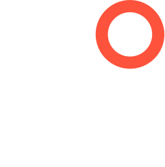

  

    
  

  <h1>OddJeeves</h1>
  <h3>Internal company knowledge platform</h3>
  
An independent, self-hosted fork of PipesHub, adapted for employee knowledge access.

OddJeeves lets employees ask questions across company knowledge sources while
preserving each person's access in the original source system. It uses an
internal LiteLLM-compatible gateway with configurable OpenAI-compatible model
routing.

## Employee connections

The `/chat` page provides user-specific connections for Slack, Notion, Miro,
Jira, Gmail, Google Drive, and Superhuman Docs. OAuth-backed MCP services use
each employee's own authorization. Superhuman Docs uses a personal, read-only
API token and includes an in-app setup guide.

Confluence Data Center Personal remains an administrator-managed connector:
admins control sync settings while each employee supplies their own credentials.
It is managed in connector administration rather than through a chat connection
card.

## Access and diagnostics

Source permissions are a hard security boundary. Never substitute a shared bot
or administrator credential for a user's own authorization. Ingested records
must preserve and enforce source ACLs during retrieval, content loading,
citations, and answer generation.

Administrators can compare safe MCP retrieval metadata at
`/workspace/mcp-servers/diagnostics/`. Trace collection is disabled by default
and excludes message bodies, secrets, and raw tool responses. See
[`docs/fork-customizations.md`](docs/fork-customizations.md) for the connection
models, implementation paths, and security invariants.

## Development and deployment

- [Contributing and local setup](CONTRIBUTING.md)
- [Repository implementation instructions](AGENTS.md)
- [Frontend conventions](frontend/CLAUDE.md)
- [Docker Compose deployment](deployment/docker-compose/ADVANCED_DEPLOYMENT.md)
- [Docker Compose configuration](deployment/docker-compose/docker-compose.yml)

This project is an independent fork of [PipesHub](https://github.com/pipeshub-ai/pipeshub-ai).
